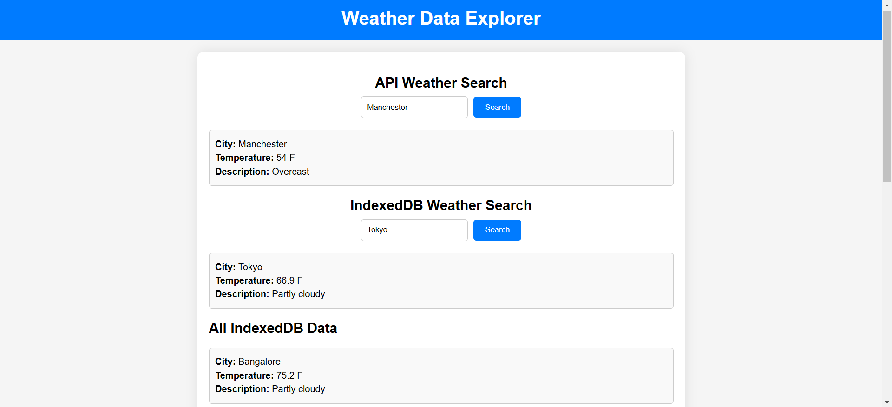

# frontend-experiments
A project to rebuild some of the popular webpages as-is to learn frontend technologies like HTML, CSS, React, etc.

## Screenshots:

### Project OUD - Tried to create a clone of Audi's homepage from 2018

### Project Fakebook - Tried to create a clone of Facebook's landing page from 2018

### File Upload Screen - A responsive web page to upload file

### Weather Display Screen - A responsive web page to search and display weather of various cities
